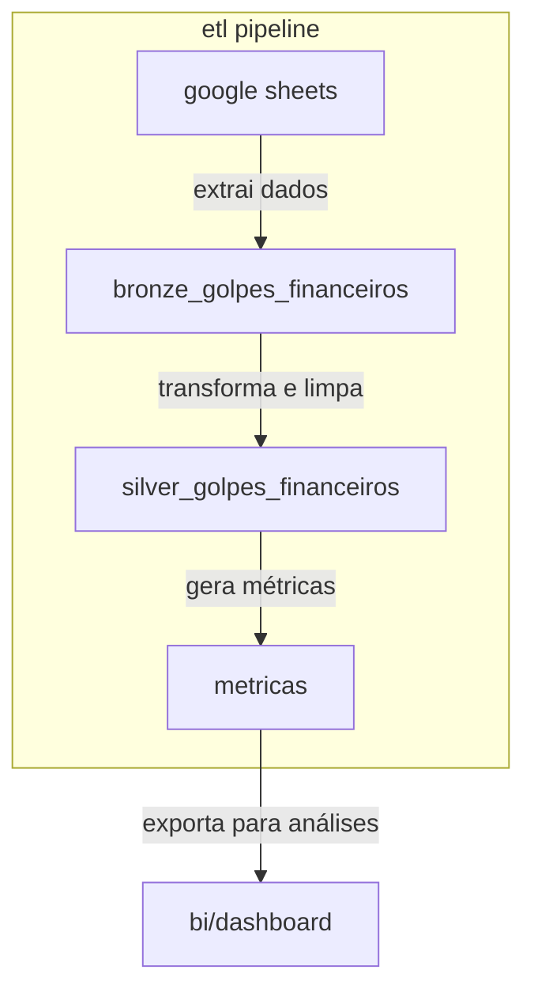

# análise de golpes financeiros com dbt

projeto para análise de dados de golpes financeiros extraídos de uma planilha no google sheets. os dados são carregados em um banco postgresql e transformados com dbt para gerar métricas e insights.

## arquitetura

- extração: planilha via google sheets api
- carga: script em python para tabela `bronze_golpes_financeiros`
- transformação: dbt (camadas bronze → silver → gold)
- armazenamento: postgresql
- análise: métricas e visualizações via bi/dashboard



## modelos dbt

### bronze: `bronze_golpes_financeiros`
- dados crus  
- colunas normalizadas  

### silver: `silver_golpes_financeiros`
- padronização e limpeza  
- remoção de inconsistências  

### gold: `silver_metricas`
- geração de kpis:  
  - percentual de vítimas  
  - golpe mais comum  
  - percentual de denúncias  
  - interesse por cursos  

## execução

```bash
# rodar extração e carga
python extract_load.py

# executar modelos dbt
dbt run

# gerar documentação interativa
dbt docs generate
dbt docs serve
```

## tecnologias

- python

- google sheets api

- postgresql

- dbt